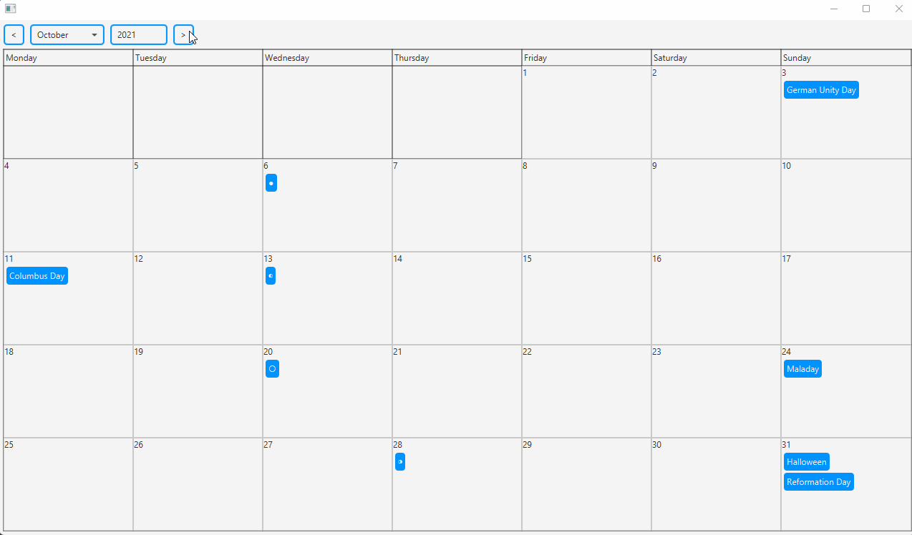

# <A javaFX calendar that calculates and displays holidays>

## Table of Contents
- [Overview](#overview:-what-is-this-project?)
- [Usage](#usage)
- [Further-information](#further-information)

## Overview: What is this project?

This project is from a programming internship at the computer science faculty of the university of wuerzburg that I attended.
(In german: Programmierpraktikum der Informatikfakultät an der Universität Würzburg)

The java written application features a calendar that shows a wide variety of holidays including official and some unofficial (also funny) ones. 
Additionally it displays phases of the moon.

Another noteworthy feature is the four-day-weekend calculation where the calendar shows all mondays or fridays, through which, in combination with a holiday on a thursday or tuesday, a four-day-weekend can be achieved by taking time off work on that normal day. 
 Note: this feature only makes sense in combination with holidays where you can stay home. 
You can choose to include official-holidays-only or your county-specific holidays by swapping the samples in the main class.

Important to note is that the GUI and the moon-phase calculator were not written by me as both have been provided as a library to use.
 As such this project is listed for presentational-purposes-only and will not compile due to the missing dependencies.

The code utilizes interesting time-oriented java standard library classes like
Temporals and TemporalAdjusters,
ChronoFields,
LocalDate,
MonthDay,
Period and more.

## Usage
 At the top of the javaFX calendar view window you can choose the date (month and year) you wish to see. The grid entries below that in the middle of the program window represent the days and show icons and names for holidays.
 My code calculates these holidays for the given month and year as well as the four-day-weekends.
It also takes leap-years into account and should work for each combination of month and year correctly.

## Further information:
This project was a program that I have written in the early stages of my programming studies.
 As such it is not a representation of my current skills.
 There are no tests here because they were handled by a svn connection to a test server.
 The code certainly needs some work in regards to readability and structure e.g. there are some really unreadably long functions, if-else monoliths/constructs, questionable decisions in regards to algorithm design and data structures as well as some unneccessary, long comments.
 I would refactor many of those and utilize some design patterns here and there if I were to improve this project's code.

